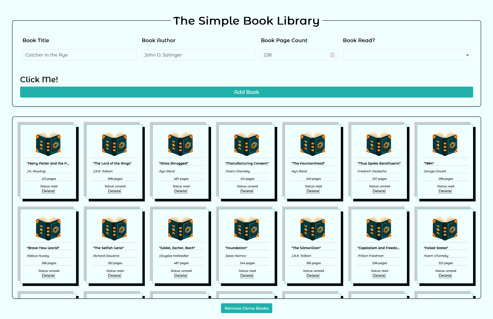
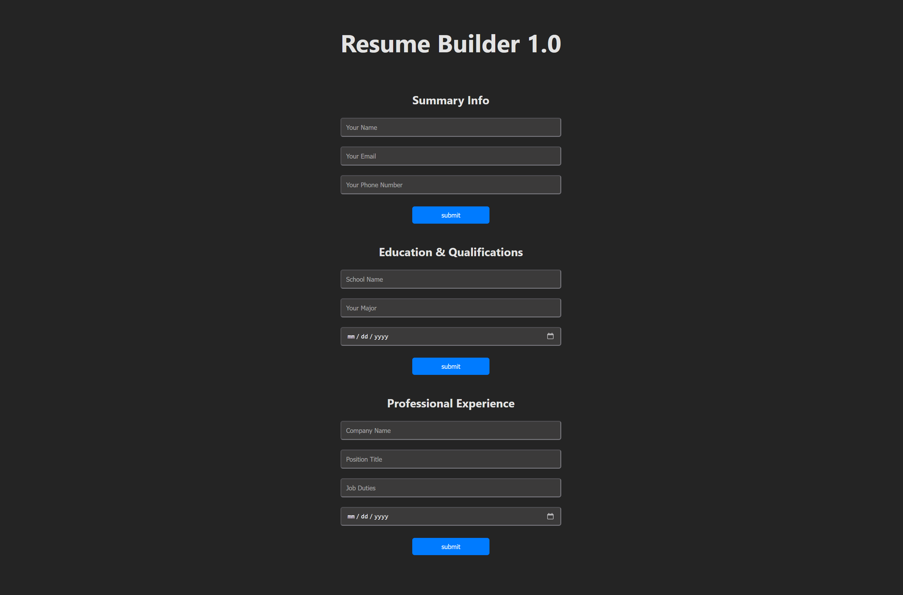
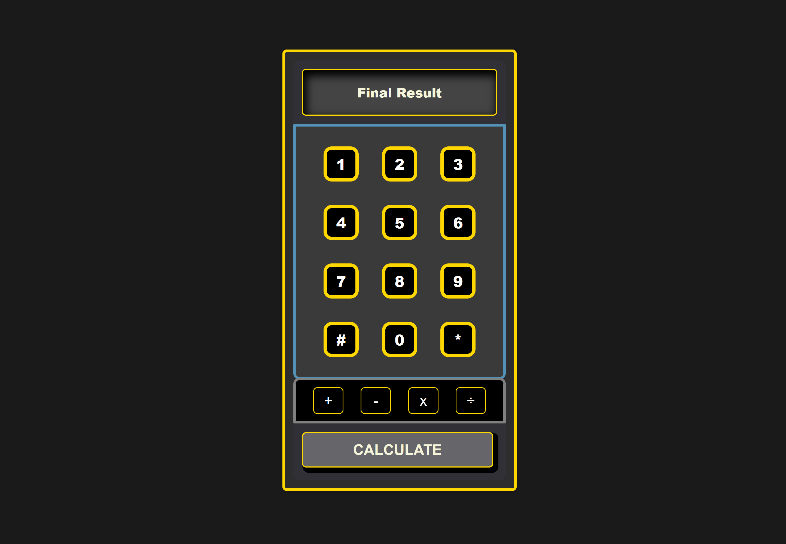
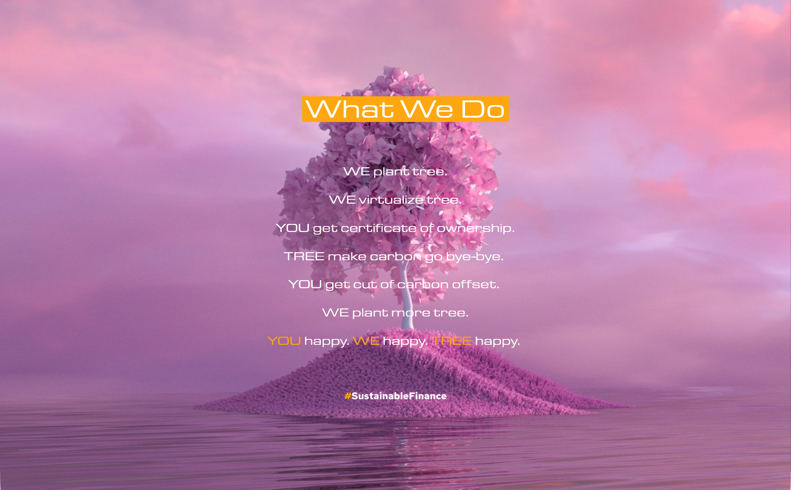
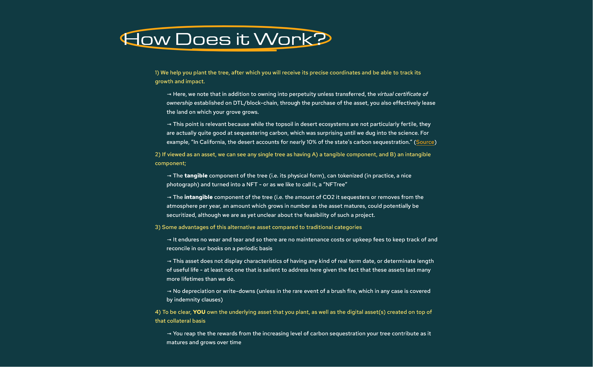
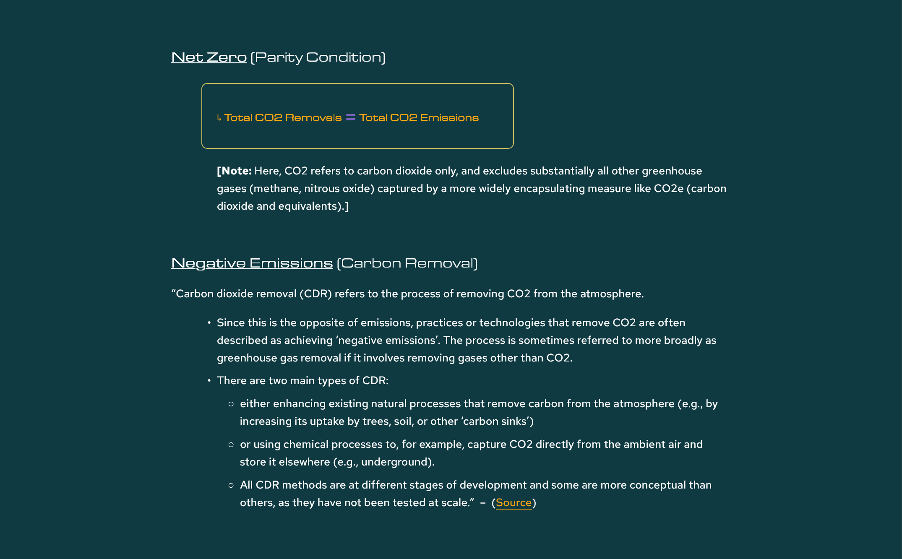
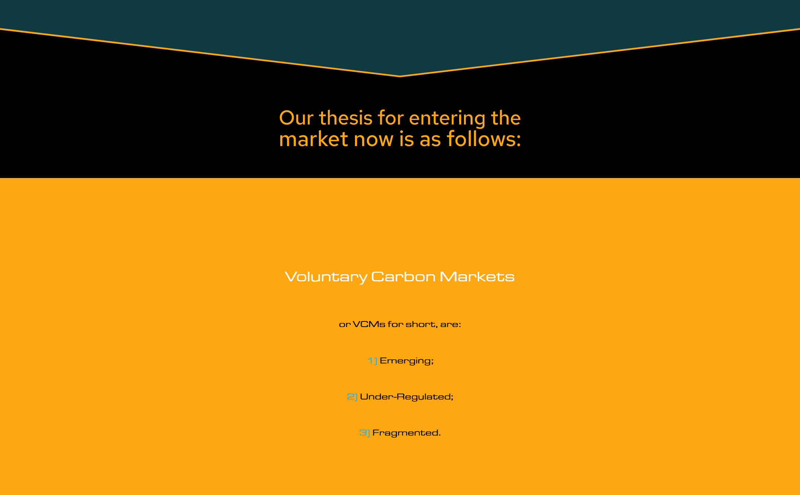

# Hi. 👋 &&. I'm || Me Llamo || 我叫  &&. Gary

Investment banker turned full-stack developer with 500+ hours of coding education through The Odin Project and Full Stack Open. Proficient in JavaScript, React, Node.js, and Python. Northwestern Economics grad bringing analytical rigor and financial domain expertise to software development. Seeking junior developer roles in web development, fintech, or data engineering.

> Fun Fact: "In 2013, only 28 babies born in England and Wales were named Gary, leading Garys to be labeled a "dying breed" ~ [Wikipedia](https://en.wikipedia.org/wiki/Gary_(given_name))

## Table of Contents

- **[Featured Project: Local LLM Integration Toolkit](#featured-project-local-llm-integration-toolkit)**
  - [📖 Full Documentation](https://github.com/myopicOracle/local-llm-guide)
  - [🎥 Video Walkthroughs](https://youtu.be/meABLedKNhY)
- **[YummyBuy E-Commerce](#yummybuy-e-commerce)**
  - [🌐 Live Site](https://www.yummybuy.ca/)
  - [📋 Project Board](https://github.com/users/myopicOracle/projects/3)
- **[The Simple Library](#the-simple-library)**
  - [📱 Live Demo](https://myopicoracle.github.io/prototypes-library/)
  - [📖 Documentation](https://github.com/myopicOracle/prototypes-library)
- **[Resume Builder React App](#resume-builder-react-app)**
  - [🚀 Live Demo](https://simple-resume-app.netlify.app/)
  - [📖 Documentation](https://github.com/myopicOracle/resume-builder)
- **[Calcutron 8000 Calculator](#calcutron-8000-calculator)**
  - [🖩 Live Demo](https://calcutron-8000.netlify.app/)
  - [💻 Repository](https://github.com/myopicOracle/calcutron-8000)
- **[The Joshua Tree Foundation](#the-joshua-tree-foundation)**
  - [🌳 Website](https://yuccapalms.org/)
  - [📸 Instagram](https://www.instagram.com/joshuatreefoundation/)
  - [💼 LinkedIn](https://www.linkedin.com/company/joshua-tree-foundation)
- **[Certifications](#certifications)**
  - [🎓 Full Stack Web Development Bootcamp - App Brewery](#certifications)
  - [📊 IBM Data Analyst Professional Certification](#certifications)
  - [🤖 Microsoft Azure AI-900](#certifications)
  - [🖥️ The Odin Project - Full Stack JavaScript Track](#certifications)
  - [📈 Data Analyst Bootcamp - NPower Canada](#certifications)
- **[Tech Stack](#tech-stack)**
- **[Let's Connect](#lets-connect)**

---

## Featured Project: Local LLM Integration Toolkit

**End-to-end AI infrastructure built from scratch** — Complete solution for running large language models locally using Ollama, featuring custom Node.js server architecture, intuitive frontend GUI, and global deployment via ngrok and Vercel. This project demonstrates the full AI development lifecycle from local setup to production deployment.

### 🎬 Live Demo Highlights

#### Handling Raw Bytes Stream from Ollama API Endpoint
  
**[Watch on YouTube](https://youtu.be/YrV2Q_hCtw8?si=yeECOJN9WFXIBH30&t=230)**

#### Exposing Your Local API for Remote Access w/ ngrok
  
**[Watch on YouTube](https://youtu.be/Ky8DzoPFd4E?si=Qs5sORy2KA3whU32)**

**Tech Stack:** Node.js, Express, Ollama API, ngrok, Vercel  
**[📖 Full Documentation](https://github.com/myopicOracle/local-llm-guide)** • **[🎥 Video Walkthroughs on YouTube](https://youtu.be/meABLedKNhY)**

---

## YummyBuy E-Commerce
*Custom e-commerce solution for local business*

Built for a bakery owner frustrated with generic website builders.

 
> [**Live Site**](https://www.yummybuy.ca/)
- Create an account using SMS verification - no email or password required
- Database: Cloud [Firestore] & Storage (Spark Plan Tier)
- Landing Page: Made with [P5.js](https://p5js.org/)
- Loading Animation: Created with [Google Veo2](https://deepmind.google/models/veo/) (circa April 2025)

**Key Features**: 
- SMS auth
- Orders & user maangement
- Data persistence using Cloud Firestore
- Cross-platform native CMS dashboard
- Inventory management
- Business analytics baked into admin view

**Tech:** React, Node.js, Express, TailwindCSS  
**[📋 Project Board](https://github.com/users/myopicOracle/projects/3)** • **[💻 Repository](https://github.com/myopicOracle/YummyBuy.ca)**

---

## The Simple Library 
*Constructors & Prototypes - 1st JavaScript Project (Dec. 2024)*

One of my first projects, and also easily one of the most memorable.

### Live Demo

➡️ [Try the Live Demo](https://myopicoracle.github.io/prototypes-library/)

Built with vanilla JavaScript, this project was my first taste of OOP, getting some reps in for prototypal-inheritance, JS classes, constructor functions, DOM manipulation, and local storage.

### What I Learned

- Object-oriented programming with JavaScript classes and prototypes
- DOM manipulation and event handling
- Form validation and data persistence
- Responsive web design principles
- Code organization and project structure

**[📖 Documentation](https://github.com/myopicOracle/prototypes-library)**

---

## Resume Builder React App
*Interactive resume builder with persistent state*

Clean, functional resume builder demonstrating React fundamentals. Features component-based architecture, form state management with hooks, and seamless edit/display mode switching. Built with DRY principles and reusable components.

**Tech:** React, JavaScript, CSS  
**[🔗 Live Demo](https://simple-resume-app.netlify.app/)** • **[📖 Documentation](https://github.com/myopicOracle/resume-builder)**

---

## Calcutron 8000 Calculator
*Vanilla JavaScript calculator with elegant UX*

Built from scratch using vanilla JavaScript with thoughtful edge case handling (including a snarky "Nice try!" for division by zero). Features proper operation logic, real-time display updates, and polished responsive design.

**Tech:** JavaScript, HTML5, CSS3  
**[🔗 Live Demo](https://calcutron-8000.netlify.app/)** • **[💻 Repository](https://github.com/myopicOracle/calcutron-8000)**

---

## The Joshua Tree Foundation  
*Non-Profit Sustainable Finance Inititative*

A comprehensive sustainability platform exploring carbon offset initiatives through innovative products like Carbon X-Trace™ and blockchain-backed NFTrees. Features in-depth analysis of carbon markets, Net Zero frameworks, and accessible environmental education through structured digital storytelling.  

**Focus:** Branding, Sustainable Finance, Fundraising, Sales & Marketing, Climate Tech, Blockchain  
**[🌳 Joshua Tree Foundation](https://yuccapalms.org/)** • **[Instagram](https://www.instagram.com/joshuatreefoundation/)** • **[LinkedIn](https://www.linkedin.com/company/joshua-tree-foundation)** 

---

## Tech Stack

**Frontend:** React, JavaScript, HTML/CSS, Tailwind CSS  
**Backend:** Node.js, Express, SQL  
**AI/ML:** Ollama, API Integration, Model Deployment  
**Currently exploring:** Python, TypeScript, Next.js, blockchain development

---

## Certifications

**Certifications:**  
_The Complete Full Stack Web Development Bootcamp - App Brewery  
_IBM Data Analyst Professional Certification  
_Microsoft Azure AI-900  
  
**Bootcamps**  
_The Odin Project - Full Stack JavaScript Track  
_Data Analyst Bootcamp - NPower Canada  

---

## Let's Connect

Always up for collaborating on interesting projects or discussing the latest in AI and full-stack development.

**[💼 LinkedIn](https://linkedin.com/in/xiagary)** • **[📧 Email](mailto:garebearcodes@gmail.com)** • **[🐙 GitHub](https://github.com/myopicOracle)**
